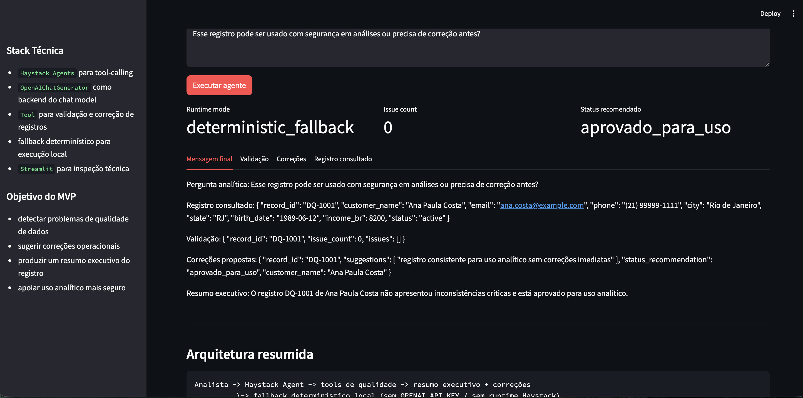
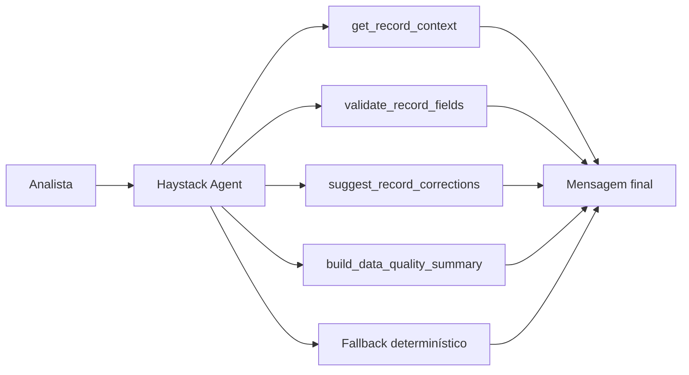

# Data Quality Agent

Um MVP de `Haystack Agents` para enriquecimento e avaliação de qualidade de dados em registros de clientes. O projeto foi desenhado para inspecionar registros, identificar inconsistências de formato e conteúdo, sugerir correções e gerar um resumo executivo grounded no dado consultado.

## Visão Geral

O sistema responde perguntas como:

- esse registro pode ser usado em análises?
- quais campos estão inconsistentes?
- que tipo de correção operacional deveria ser aplicada?
- o registro pode seguir para consumo analítico ou deve ser bloqueado?

## Interface



## Arquitetura



## Topologia de Execução

O projeto foi estruturado em quatro camadas:

1. `record layer`
   - carrega o registro original;
2. `quality tools layer`
   - valida, classifica e recomenda correções;
3. `agent orchestration layer`
   - usa `Haystack Agent` com tools quando o runtime está disponível;
4. `presentation layer`
   - expõe o fluxo via `CLI` e `Streamlit`.

## Estrutura do Projeto

- [src/sample_data.py](/Users/flaviagaia/Documents/CV_FLAVIA_CODEX/data_quality_agent/src/sample_data.py)
  - base demo de registros.
- [src/tools.py](/Users/flaviagaia/Documents/CV_FLAVIA_CODEX/data_quality_agent/src/tools.py)
  - tools de validação, correção e resumo.
- [src/agent.py](/Users/flaviagaia/Documents/CV_FLAVIA_CODEX/data_quality_agent/src/agent.py)
  - orquestração com `Haystack Agents` e fallback.
- [app.py](/Users/flaviagaia/Documents/CV_FLAVIA_CODEX/data_quality_agent/app.py)
  - console técnico em `Streamlit`.
- [main.py](/Users/flaviagaia/Documents/CV_FLAVIA_CODEX/data_quality_agent/main.py)
  - execução rápida e persistência do relatório.
- [tests/test_agent.py](/Users/flaviagaia/Documents/CV_FLAVIA_CODEX/data_quality_agent/tests/test_agent.py)
  - validação do fluxo principal.

## Como o Haystack Agent foi modelado

O runtime planejado usa:

- `OpenAIChatGenerator`
  - backend do modelo de chat;
- `Tool`
  - wrapper das funções de domínio;
- `Agent`
  - componente agentic experimental do Haystack com tool-calling.

### Decisões de design

- `OpenAIChatGenerator`
  - escolhido como backend de geração no runtime agentic por se integrar diretamente ao modelo de chat esperado pelo fluxo;
- `Tool`
  - usado para encapsular regras de domínio de qualidade sem acoplar validação ao modelo;
- `Agent`
  - empregado como orquestrador de tool-calling, mantendo a resposta grounded nas ferramentas;
- `deterministic_fallback`
  - preserva o contrato de saída e permite validação local sem dependência de credenciais externas;
- `record grounding`
  - garante que o agente responda apenas sobre o registro consultado, sem inventar atributos.

Essa separação mantém o projeto organizado em:

- camada de dado bruto;
- camada de validação;
- camada de recomendação;
- camada de orquestração agentic;
- camada de apresentação.

### Tools registradas

- `get_record_context`
- `validate_record_fields`
- `suggest_record_corrections`
- `build_data_quality_summary`

### Runtime modes

1. `haystack_agent`
   - usado quando o runtime Haystack está disponível com `OPENAI_API_KEY`;
2. `deterministic_fallback`
   - usado para execução local reprodutível.

### Contrato funcional entre tools e agente

O agente foi desenhado para consolidar a resposta final a partir de quatro estágios:

1. leitura do registro original;
2. validação de formato e consistência;
3. geração de correções operacionais;
4. síntese executiva da qualidade do dado.

Isso transforma o agente em um `data quality orchestrator`, e não apenas em um redator de texto livre.

## Tools de Qualidade

### `validate_record_fields`
Valida:

- e-mail;
- telefone;
- data de nascimento;
- renda;
- presença de nome.

Heurísticas aplicadas no MVP:

- e-mail validado por expressão regular básica;
- telefone normalizado para contagem de dígitos e aceito apenas com `10` ou `11` dígitos;
- data de nascimento validada no formato `yyyy-mm-dd`;
- renda negativa tratada como inconsistência crítica;
- nome vazio tratado como falha de completude.

### `suggest_record_corrections`
Gera recomendações operacionais para correção.

Essa tool transforma cada `issue` em uma ação de remediação explicitamente rastreável, como:

- correção manual de e-mail;
- normalização de telefone;
- revisão da captura de data;
- bloqueio de renda negativa para uso analítico.

### `build_data_quality_summary`
Gera um resumo executivo customer-master-ready sobre o registro.

Ela atua como um `executive summarizer`, condensando:

- quantidade de problemas;
- natureza das inconsistências;
- decisão operacional sugerida

em uma leitura curta para consumo por times de dados, operações ou governança.

## Modelo de Dados

Os registros demo incluem:

- `record_id`
- `customer_name`
- `email`
- `phone`
- `city`
- `state`
- `birth_date`
- `income_br`
- `status`

## Exemplo de Registro

```json
{
  "record_id": "DQ-1002",
  "customer_name": "Carlos Mendes",
  "email": "carlos.mendesatexample.com",
  "phone": "21988887777",
  "city": "São Paulo",
  "state": "SP",
  "birth_date": "1994/02/30",
  "income_br": -1500,
  "status": "active"
}
```

## Contrato de Saída

`ask_data_quality_agent()` retorna:

```json
{
  "runtime_mode": "haystack_agent | deterministic_fallback",
  "record_id": "DQ-1002",
  "record": {},
  "validation": {},
  "corrections": {},
  "summary": "texto",
  "final_message": "texto final"
}
```

### Semântica do retorno

- `runtime_mode`
  - indica se a resposta veio do runtime Haystack ou do fallback local;
- `record`
  - snapshot canônico do registro consultado;
- `validation`
  - camada analítica com quantidade e tipo de problemas;
- `corrections`
  - conjunto de ações operacionais sugeridas;
- `summary`
  - leitura executiva da condição do dado;
- `final_message`
  - resposta consolidada para o analista.

Esse contrato único facilita integração futura com pipelines de qualidade, logs ou APIs.

## Persistência e Artefatos

O script [main.py](/Users/flaviagaia/Documents/CV_FLAVIA_CODEX/data_quality_agent/main.py) gera o artefato:

- `data/processed/data_quality_report.json`

Esse arquivo é produzido em runtime para auditoria local e não faz parte dos arquivos versionados do repositório.

## Interface Streamlit

O app funciona como um `inspection console` para:

- selecionar o registro;
- submeter uma pergunta analítica;
- inspecionar os problemas encontrados;
- visualizar correções e resumo executivo.

Na prática, o Streamlit funciona como uma `debuggable presentation layer`, permitindo:

- comparar o registro original com a validação derivada;
- verificar coerência entre problemas detectados e sugestões;
- inspecionar o contrato retornado pelo agente;
- demonstrar o fluxo de qualidade sem depender apenas do código.

## Validação

Os testes em [tests/test_agent.py](/Users/flaviagaia/Documents/CV_FLAVIA_CODEX/data_quality_agent/tests/test_agent.py) verificam:

- detecção de problemas em um registro inconsistente;
- retorno de status de correção;
- existência de mensagem final consolidada.

Além disso, o projeto foi validado com:

```bash
python3 main.py
python3 -m unittest discover -s tests -v
python3 -m py_compile app.py src/agent.py src/tools.py src/sample_data.py main.py
```

## Execução Local

### Pipeline principal

```bash
python3 main.py
```

### Testes

```bash
python3 -m unittest discover -s tests -v
```

### Interface

```bash
streamlit run app.py
```

## Limitações

- base demo pequena;
- regras de validação simples;
- runtime real depende de `Haystack` + `OPENAI_API_KEY`;
- fallback determinístico para portabilidade local.

## Roadmap Técnico

Possíveis evoluções para uma versão mais robusta:

- validação cruzada entre múltiplos registros;
- detecção de duplicidade e record linkage;
- normalização automática de atributos;
- scoring agregado de qualidade por registro;
- integração com data contracts e pipelines ETL;
- observabilidade do runtime agentic e das regras de qualidade.

## English Version

`Data Quality Agent` is a `Haystack Agents` MVP for data enrichment and data quality evaluation. The project inspects customer records, detects formatting and consistency issues, recommends remediation steps, and produces an executive summary grounded in the queried record. When the Haystack runtime is unavailable, a deterministic fallback preserves the same output contract for local reproducibility.

## Interface


### Technical Highlights

- `Agent` with tool-calling over `OpenAIChatGenerator`
- `Tool` wrappers around domain validation functions
- deterministic fallback for local execution
- structured record context as the grounding layer
- Streamlit inspection console
- explicit separation between record, validation, correction, orchestration, and presentation layers
- rule-based validation heuristics for email, phone, date, income, and completeness
