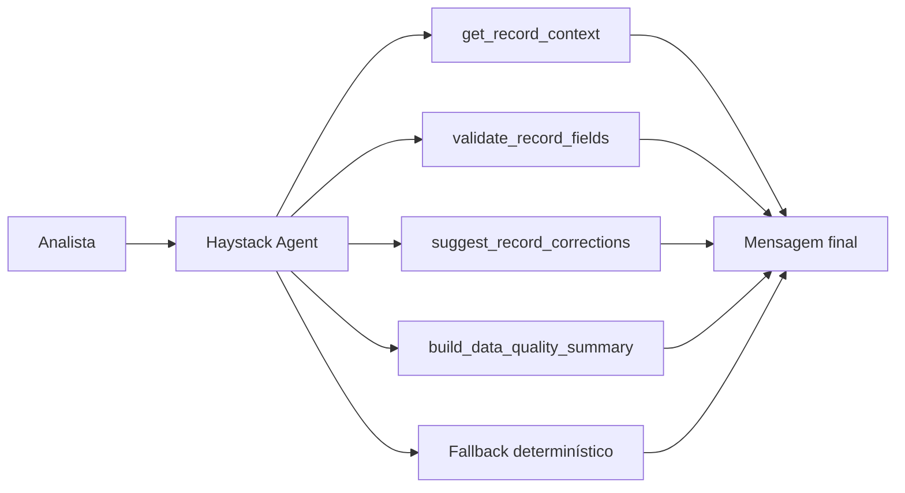

# Data Quality Agent

Um MVP de `Haystack Agents` para enriquecimento e avaliação de qualidade de dados em registros de clientes. O projeto foi desenhado para inspecionar registros, identificar inconsistências de formato e conteúdo, sugerir correções e gerar um resumo executivo grounded no dado consultado.

## Visão Geral

O sistema responde perguntas como:

- esse registro pode ser usado em análises?
- quais campos estão inconsistentes?
- que tipo de correção operacional deveria ser aplicada?
- o registro pode seguir para consumo analítico ou deve ser bloqueado?

## Arquitetura



## Topologia de Execução

O projeto foi estruturado em quatro camadas:

1. `record layer`
   - carrega o registro original;
2. `quality tools layer`
   - valida, classifica e recomenda correções;
3. `agent orchestration layer`
   - usa `Haystack Agent` com tools quando o runtime está disponível;
4. `presentation layer`
   - expõe o fluxo via `CLI` e `Streamlit`.

## Estrutura do Projeto

- [src/sample_data.py](/Users/flaviagaia/Documents/CV_FLAVIA_CODEX/data_quality_agent/src/sample_data.py)
  - base demo de registros.
- [src/tools.py](/Users/flaviagaia/Documents/CV_FLAVIA_CODEX/data_quality_agent/src/tools.py)
  - tools de validação, correção e resumo.
- [src/agent.py](/Users/flaviagaia/Documents/CV_FLAVIA_CODEX/data_quality_agent/src/agent.py)
  - orquestração com `Haystack Agents` e fallback.
- [app.py](/Users/flaviagaia/Documents/CV_FLAVIA_CODEX/data_quality_agent/app.py)
  - console técnico em `Streamlit`.
- [main.py](/Users/flaviagaia/Documents/CV_FLAVIA_CODEX/data_quality_agent/main.py)
  - execução rápida e persistência do relatório.
- [tests/test_agent.py](/Users/flaviagaia/Documents/CV_FLAVIA_CODEX/data_quality_agent/tests/test_agent.py)
  - validação do fluxo principal.

## Como o Haystack Agent foi modelado

O runtime planejado usa:

- `OpenAIChatGenerator`
  - backend do modelo de chat;
- `Tool`
  - wrapper das funções de domínio;
- `Agent`
  - componente agentic experimental do Haystack com tool-calling.

### Tools registradas

- `get_record_context`
- `validate_record_fields`
- `suggest_record_corrections`
- `build_data_quality_summary`

### Runtime modes

1. `haystack_agent`
   - usado quando o runtime Haystack está disponível com `OPENAI_API_KEY`;
2. `deterministic_fallback`
   - usado para execução local reprodutível.

## Tools de Qualidade

### `validate_record_fields`
Valida:

- e-mail;
- telefone;
- data de nascimento;
- renda;
- presença de nome.

### `suggest_record_corrections`
Gera recomendações operacionais para correção.

### `build_data_quality_summary`
Gera um resumo executivo customer-master-ready sobre o registro.

## Modelo de Dados

Os registros demo incluem:

- `record_id`
- `customer_name`
- `email`
- `phone`
- `city`
- `state`
- `birth_date`
- `income_br`
- `status`

## Exemplo de Registro

```json
{
  "record_id": "DQ-1002",
  "customer_name": "Carlos Mendes",
  "email": "carlos.mendesatexample.com",
  "phone": "21988887777",
  "city": "São Paulo",
  "state": "SP",
  "birth_date": "1994/02/30",
  "income_br": -1500,
  "status": "active"
}
```

## Contrato de Saída

`ask_data_quality_agent()` retorna:

```json
{
  "runtime_mode": "haystack_agent | deterministic_fallback",
  "record_id": "DQ-1002",
  "record": {},
  "validation": {},
  "corrections": {},
  "summary": "texto",
  "final_message": "texto final"
}
```

## Interface Streamlit

O app funciona como um `inspection console` para:

- selecionar o registro;
- submeter uma pergunta analítica;
- inspecionar os problemas encontrados;
- visualizar correções e resumo executivo.

## Execução Local

### Pipeline principal

```bash
python3 main.py
```

### Testes

```bash
python3 -m unittest discover -s tests -v
```

### Interface

```bash
streamlit run app.py
```

## Limitações

- base demo pequena;
- regras de validação simples;
- runtime real depende de `Haystack` + `OPENAI_API_KEY`;
- fallback determinístico para portabilidade local.

## English Version

`Data Quality Agent` is a `Haystack Agents` MVP for data enrichment and data quality evaluation. The project inspects customer records, detects formatting and consistency issues, recommends remediation steps, and produces an executive summary grounded in the queried record. When the Haystack runtime is unavailable, a deterministic fallback preserves the same output contract for local reproducibility.

### Technical Highlights

- `Agent` with tool-calling over `OpenAIChatGenerator`
- `Tool` wrappers around domain validation functions
- deterministic fallback for local execution
- structured record context as the grounding layer
- Streamlit inspection console
